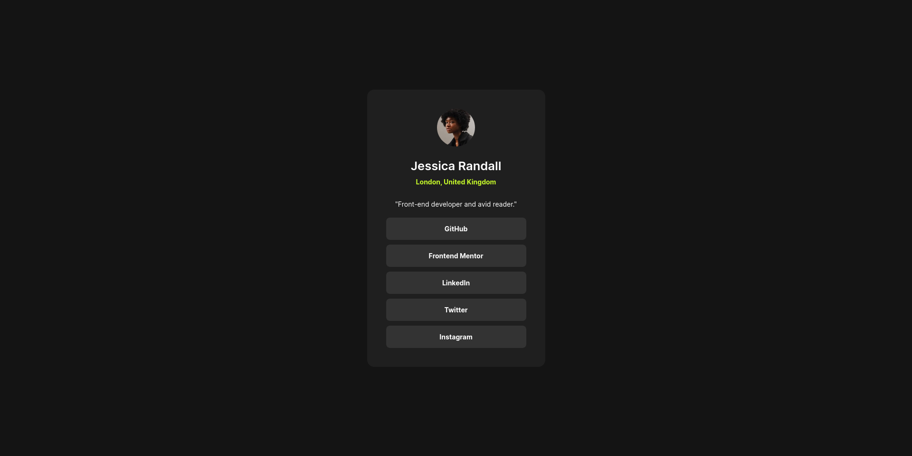

# Frontend Mentor - Social links profile solution

This is a solution to the [Social links profile challenge on Frontend Mentor](https://www.frontendmentor.io/challenges/social-links-profile-UG32l9m6dQ). Frontend Mentor challenges help you improve your coding skills by building realistic projects. 

## Table of contents

- [Overview](#overview)
  - [The challenge](#the-challenge)
  - [Screenshot](#screenshot)
  - [Links](#links)
- [My process](#my-process)
  - [Built with](#built-with)
- [Author](#author)

## Overview

### The challenge

Users should be able to:

- See hover and focus states for all interactive elements on the page

### Screenshot

### Links

- Solution URL: [Click Here](https://www.frontendmentor.io/solutions/social-links-tR0gOcnehc)
- Live Site URL: [Click Here](https://sibi404.github.io/frontendmentor-social-links/)

## My process

### Built with

- Semantic HTML5 markup
- CSS custom properties
- Flexbox

## Author

- Email - [sibikottukandiyil2@gmail.com](mailto:sibikottukandiyil2@gmail.com)
- Frontend Mentor - [sibi404](https://www.frontendmentor.io/profile/sibi404)
- LinkedIn - [SIBI K](https://www.linkedin.com/in/sibi-k-6a6848211/)
